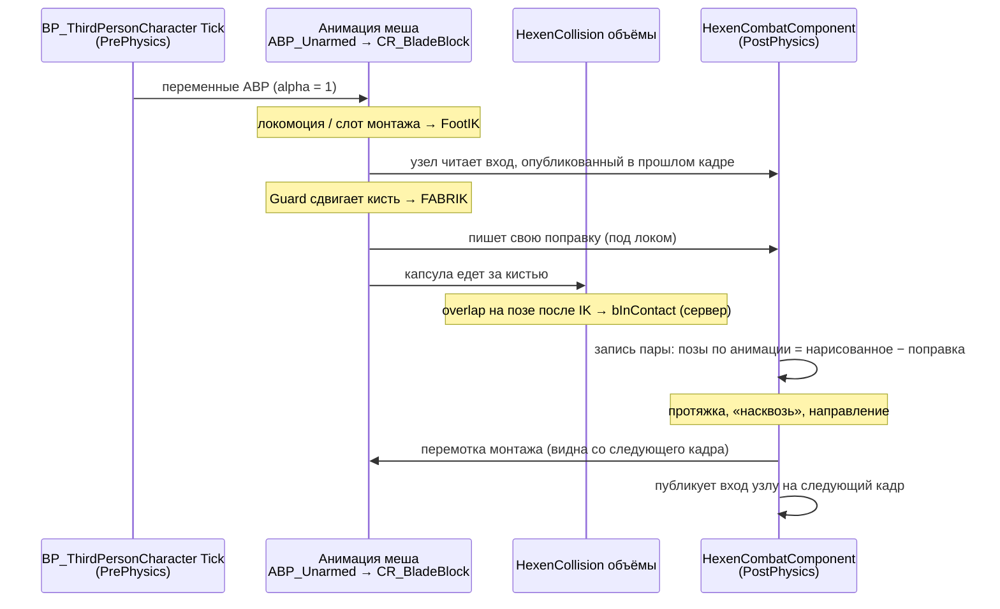

# HexenCollision — контакт клинков

Живой документ. Обновляется при каждой смене механики. Последнее обновление: 2026-09-15.
Веб-версия (то же содержание): https://claude.ai/artifact/LXwQj6BLZG37FtEy3AfyZn

`Hexen` в именах — чтобы не путать с встроенной коллизией UE. Всё здесь про абстрактные коллизионные объёмы `UHexenCollisionComponent`: клинки (`UWeaponCollisionComponent`) и в будущем части тела (`UBodyCollisionComponent`) наследуются от него и должны работать одинаково.

> **Переименование запланировано на следующую сессию.** Сейчас в коде имена `BladeGuard*`; они станут `HexenCollisionGuard*` (таблица ниже), узел rig — `Hexen Collision Guard`. В этом документе указаны оба имени.

---

## 1. Текущая механика (итерация 11)

**Идея:** твёрдая поверхность, а не цель. Каждый кадр смотрим, куда анимация хочет поставить объём, и сдвигаем его, только если он войдёт в чужой, ровно на глубину пересечения. Толкает, но никогда не тянет; между кадрами хранится только общее решение на пару.

Части:

1. **Узел rig `Hexen Blade Guard`** (`FRigUnit_HexenBladeGuard`, `HexenBladeGuardUnit.h/.cpp`) в `CR_BladeBlock`, перед FABRIK.
   Берёт *анимированную* кисть (до IK), строит по ней свою капсулу, меряет пересечение с капсулой партнёра вдоль общего направления пары и сдвигает кисть на свою долю глубины (`Share` = 0.5). FABRIK (`clavicle_r` → `hand_r`) доводит руку.
2. **Одно решение на пару** (`UpdateBladePair`, `HexenCombatComponent.cpp`). Одна запись на пару объёмов: направление «врозь», признак «пронесло насквозь» (с гистерезисом), протяжка между кадрами. Её обновляет тот боец, чей компонент первым тикнул в кадре; второй только читает. Оба получают одно направление с противоположными знаками.
3. **Протяжка.** Если в прошлом кадре объёмы не касались, путь между прошлой и текущей позой прогоняется за `SweepSteps` подшагов: кисть — положение по прямой, поворот по дуге, капсула строится от кисти. Находится доля кадра, где объёмы сошлись.
4. **Перемотка удара.** При найденном касании каждый боец пары, у кого идёт монтаж, перематывает его назад на эту долю кадра и ставит на паузу (`RewindSwingToTouch`). Через `PauseSeconds` таймер отпускает.
5. **Пауза при первом толчке.** Если касание не пришло из протяжки, монтаж ставится на паузу в кадре, где узел впервые начал толкать.
6. **Отпускание.** Если объём унесло за чужой дальше `MaxPushBack`, узел его отпускает, а не выдёргивает руку.

Отключены в этом режиме (код остался): храповик по 1 см, заморозка позы (`Pose Snapshot`), пауза монтажа по пересечению капсул.

### Порядок выполнения в кадре

Считается **на каждой машине** (сервер и оба клиента) по своим позам. Состояние контакта для игры (`bInContact`) по-прежнему решает сервер и реплицирует.

Следствия, которые важно помнить:
- решение пары приходит в rig **с опозданием на кадр**;
- перемотка видна **со следующего кадра** — один кадр клинок ещё за чужим;
- поза партнёра в узле — его поза прошлого кадра.

---

## 2. Параметры

`UHexenCombatComponent`, категория `Combat|Guard`:

| Сейчас | Будет | Значение | Смысл |
|---|---|---|---|
| `bUseBladeGuard` | `bUseHexenCollisionGuard` | true | Включает всю механику; выключает храповик, заморозку, старую паузу |
| `BladeGuardShare` | `HexenCollisionGuardShare` | 0.5 | Доля пересечения, которую берёт на себя этот боец |
| `BladeGuardSkin` | `HexenCollisionGuardSkin` | 1 см | Насколько капсулы остаются внутри касания, чтобы overlap не мигал |
| `BladeGuardRange` | `HexenCollisionGuardRange` | 300 см | Дальше этого чужие объёмы не рассматриваются |
| `BladeGuardPauseSeconds` | `HexenCollisionGuardPauseSeconds` | 0.5 с | Сколько удар стоит после касания (заглушка) |
| `BladeGuardMaxPushBack` | `HexenCollisionGuardMaxPushBack` | 40 см | Дальше — отпустить, не тянуть назад |
| `BladeGuardSweepSteps` | `HexenCollisionGuardSweepSteps` | 12 | Подшагов протяжки |
| `bPauseMontageOnContact` | — | true | Разрешает паузу и перемотку |

Типы и функции: `FHexenBladeGuardInput/Result` → `FHexenCollisionGuardInput/Result`, `FHexenBladePair` → `FHexenCollisionPair`, `GetBladeVolumes` → `GetGuardedVolumes` (пока берёт только оружие: у тела нет кости-носителя).

Капсула клинка (`BP_Weapontest4`, `WeaponCollision`): радиус 15, полувысота 60, смещение z = −62.8.

Старые, в режиме guard не действуют: `ContactStep` (1 в BP), `ContactReachedFraction` 0.25, `ContactStallFrames` 3, `ContactBlendReleaseSpeed` (1 в BP), `bFreezePoseOnContact`, `ContactPoseSnapshotName`.

---

## 3. Отладка

| Флаг | Где | Что даёт |
|---|---|---|
| `bLogContactSteps` | HexenCombat на персонаже (вкл) | `[GUARD]` и `[BIND]` в лог |
| `bDrawContactPoints` | там же (вкл) | точка контакта (жёлтая) и поправка (красная стрелка) |
| `bSpawnPhysicsGhost` | `WeaponCollision` в `BP_Weapontest4` (вкл) | физический двойник капсулы, `[GHOST]` |

**Теги лога:**
- `[GUARD] <боец> srv|cli f<кадр> START|push|END [CROSSED] | depth | correction | normal` — работа узла по кадрам.
- `[GUARD] ... SWEEP touch at N% | <монтаж> rewound a -> b` — протяжка нашла касание и перемотала удар.
- `[GHOST] ... HIT` — первое касание физических двойников: точка, нормаль, импульс решателя и наш расчёт рядом. `END` — насколько физика удерживала двойника от настоящего клинка.

**Призрак-линейка.** Для каждого клинка — отдельная симулируемая капсула с CCD, которую каждый кадр скоростью тянут в позу настоящего. Призраки блокируют только друг друга (канал `GameTraceChannel2` = `HexenGhost`). «Держал до N см» — насколько настоящий клинок ушёл дальше, чем пустила бы твёрдая коллизия.

**Как тестировать:** PIE → удары и удержания → лог `Saved/Logs/Hexenhammer.log` от последней строки `PIE: Play in editor total start time`. Сравнивать прогоны только при похожих условиях: FPS (PIE идёт 19–43 к/с, редактор без фокуса падает до 3 к/с, видеопамять переполнена) и число контактов.

**Ассеты, изменённые вне git:** `CR_BladeBlock` (цепочка Begin → Guard → FABRIK, старые `SetTransform_1/_3` отключены), `ABP_Unarmed` (Blend Poses by bool + Pose Snapshot), `BP_ThirdPersonCharacter` (Tick ставит `ContactPoseFrozen`), `BP_Weapontest4` (`bSpawnPhysicsGhost`).

---

## 4. Открытые вопросы

1. **После перемотки клинок всё ещё в чужом** — в среднем 22 см, ни разу не ближе 5 см. Версии: протяжка неверно предсказывает кисть; двигался второй боец; двигалось всё тело ударившего.
   **Следующий шаг (отложен):** при перемотке запомнить предсказанные кисти обоих, в следующем кадре записать, насколько настоящие от них отличаются.
2. **~90% касаний без монтажа** ни у одного бойца — что их вызывает (шаг, поворот, стойка), неизвестно. Перемотка им не помогает.
3. **Правило отпускания удара** — сейчас таймер 0.5 с; задумано «следующее действие бойца».
4. **Несколько контактов сразу** — сейчас берётся только ближайший чужой объём.
5. **Части тела** — механика пока только для оружия.
6. **Полный эталон** — Physical Animation + Physics Asset (планируется).

---

## 5. Журнал итераций

| # | Дата | Что сделали | Что показали замеры | Почему дальше |
|---|---|---|---|---|
| 0 | до 09-13 | Overlap на толстых капсулах, храповик на сервере: цель = точка контакта + 1 см по нормали, реплицируется; rig тянет задетое место к цели; пауза монтажа при контакте | — | клинки проходили сквозь |
| 1 | 09-13 | Храповик шагает и при «застое» (3 кадра без сближения) | 153 шага (109 по застою), зазор на сервере ~5 см; клинки расходятся | «точка тянет не туда» |
| 2 | 09-13 | Диагностика клиент/сервер | точка клиента от серверной: среднее 7 см, максимум 46; пауза монтажа сработала в 20 контактах из 806 | позы клиентов расходятся с сервером |
| 3 | 09-13 | Заморозка позы на всех машинах (Pose Snapshot) | попадание в цель <5 см: сервер 66→96%, клиенты 23→73%; хвост >15 см 6→9% | место на клинке по машинам разное (~14 см) |
| 4 | 09-15 | Сравнение с запросами Chaos (удалено) | в той же позе наша нормаль = Chaos (0.0°), глубина та же; точка первого касания — нормаль развёрнута >90° в 7% при 35–65 см/кадр | ты имел в виду блокирующую физику |
| 5 | 09-15 | Физический призрак с CCD (тик в PrePhysics, иначе раскачка) | в момент касания нормаль в пределах 3.4°, точка ~2 см; после касания двойник держал в среднем 20 см, до 120; 203 из 262 контактов — 1 шаг, новый через 0.07 с | виноват отклик: IK тянет к точке (двусторонне) + медленное отпускание |
| 6 | 09-15 | Узел в rig по анимированной позе, без храповика/заморозки/паузы | 50 из 79 контактов — один кадр; 32 по другую сторону; нормаль разворачивалась в 20 | не помнит, с какой стороны пришёл |
| 7 | 09-15 | Память о стороне (у каждого бойца своя) | по другую сторону 41 из 110; проход видит только один боец в 347 кадрах против 254 у обоих | удар продолжает нести руку |
| 8 | 09-15 | Пауза удара 0.5 с при первом толчке | монтаж был в 30 из 260 начал; оба бойца толкали в одну сторону в 197 из 296 кадров, корпус гнулся | сцепка и тянут друг друга |
| 9 | 09-15 | Одно решение на пару + цепочка от ключицы | в одну сторону — 0 кадров; по другую сторону 39%; удар: в первом кадре уже 42 см, насквозь в 3 из 4 | удар проскакивает между кадрами |
| 10 | 09-15 | Протяжка (концы по прямой) + перемотка монтажа | 126 касаний, 10 перемоток; после перемотки 31–45 см в чужом; по другую сторону 62% | прямая срезает дугу удара |
| 11 | 09-15 | Протяжка через кисть (поворот по дуге) | после перемотки 22 см (0 из 10 ≤ 5 см); по другую сторону 32%; призрак 21.8 / медиана 20.8 см; 30 к/с | см. открытый вопрос 1 |

---

## 6. Решения и ограничения

- **Без физической симуляции на сервере** — дорого. Физика только для отладки (призрак, выключен по умолчанию, в shipping не попадает).
- **Логика контакта — на сервере.** Сдвиг клинка в rig считается на каждой машине по своим позам, это визуальное; состояние контакта для игры решает сервер.
- **Почему в rig, а не по позе после IK:** проверка по уже сдвинутой позе кормит поправку в её же вход с опозданием на кадр — такая петля раскачивается.
- **Почему одно решение на пару:** бойцы, решавшие каждый за себя, могли толкать в одну сторону и тащить друг друга, и расходиться в признаке «насквозь».
