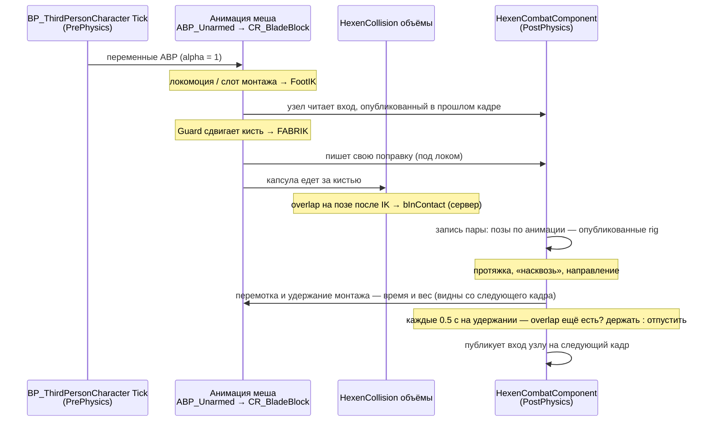

# HexenCollision — контакт клинков

Живой документ. Обновляется при каждой смене механики. Последнее обновление: 2026-09-22.
Веб-версия отстала на итерации 22–29: https://claude.ai/artifact/LXwQj6BLZG37FtEy3AfyZn

`Hexen` в именах — чтобы не путать с встроенной коллизией UE. Всё здесь про абстрактные коллизионные объёмы `UHexenCollisionComponent`: клинки (`UWeaponCollisionComponent`) и в будущем части тела (`UBodyCollisionComponent`) наследуются от него и должны работать одинаково.

> **2026-09-16: имена переведены на `HexenCollisionGuard*`.** Старые `BladeGuard*` и узел `Hexen Blade Guard` перенаправляются через секцию `[CoreRedirects]` в `DefaultEngine.ini`: узел в `CR_BladeBlock` и сохранённые значения свойств переносятся сами. Механика при переименовании не менялась.

---

## 1. Текущая механика (итерация 29)

**Идея:** твёрдая поверхность, а не цель. Каждый кадр смотрим, куда анимация хочет поставить объём, и сдвигаем его, только если он войдёт в чужой, ровно на глубину пересечения. Толкает, но никогда не тянет; между кадрами хранится только общее решение на пару.

Части:

1. **Узел rig `Hexen Collision Guard`** (`FRigUnit_HexenCollisionGuard`, `HexenCollisionGuardUnit.h/.cpp`) в `CR_BladeBlock`, перед FABRIK.
   Берёт *анимированную* кисть (до IK), строит по ней свою капсулу, меряет пересечение с капсулой партнёра вдоль общего направления пары и сдвигает на свою долю глубины (`Share` = 0.5).
   **Целится костью оружия** (итерация 24, твоя идея). У узла есть пин `ContactBone` (по умолчанию `WeaponContactBone`) — кость в иерархии rig, висящая на `hand_r`; в меше её нет и не нужно. Каждый кадр узел ставит её глобальным трансформом ровно в ту точку своего клинка, которая касается чужого, и выдаёт эффектором эту же точку, отодвинутую на поправку. Цепочка FABRIK заканчивается на ней: `clavicle_r → upperarm_r → lowerarm_r → hand_r → WeaponContactBone`. Решателю теперь надо вывести из чужого клинка **конкретную точку на клинке**, а не кисть, и дотянуться он может доворотом запястья. Раньше кисть просто переносили, и запястье в исправлении не участвовало вовсе.
   Замер (`[SPLIT]`, 6440 кадров контакта): доворот кисти даёт **121%** запрошенной поправки (у острия 123%, у кисти 110%), медиана по кадрам 135%, ≥50% в 95% кадров, средний доворот 8.5°. Больше 100% — не ошибка: FABRIK тянет конец цепочки в цель и по дороге отводит кисть назад (в половине кадров рука идёт **против** поправки), так что доворот перекрывает и это.
   Публикует, где по анимации его клинок и кисть (в мире): по этой позе меряет партнёр и решает пара (итерация 14). Раньше её восстанавливали как «нарисованное − поправка», и она ошибалась на 10–45 см.
2. **Одно решение на пару** (`UpdateCollisionPair`, `HexenCombatComponent.cpp`). Одна запись на пару объёмов: направление «врозь», признак «пронесло насквозь», протяжка между кадрами. Её обновляет тот боец, чей компонент первым тикнул в кадре; второй только читает. Оба получают одно направление с противоположными знаками.
   Смена сторон (поворот направления больше чем на 90° за кадр) читается как «пронесло насквозь» (клинок держат на своей стороне), если протяжка в этом кадре нашла касание, или в прошлом кадре клинки касались (по позе анимации, ближе суммы радиусов — итерация 19), или ближайшие точки обоих клинков лежат на их телах. Иначе это «обход острия»: направление идёт за клинками. Касаясь, клинки не могут сменить стороны, не пройдя друг сквозь друга: скольжение вокруг торца поворачивает направление понемногу каждый кадр, и сторона следует за ним. «Насквозь» держится, пока анимации не вернут клинки на свои стороны или пока не кончится overlap — капсулы, которые пересекались, перестали пересекаться (итерация 16). Если overlap ещё не начинался (удар проскочил между кадрами), это не конец.
   **«Насквозь» объявляется только при настоящем касании** (итерация 26): объёмы должны быть друг в друге в этом кадре или в прошлом, либо протяжка должна была поймать встречу между кадрами. Одной смены сторон мало. Без этого условия состояние не покидалось **никогда**: снимается оно возвратом клинков или концом overlap, а overlap, который не начинался, кончиться не может. В прогоне 09-21 одна такая защёлка держалась 1172 кадра, и узел толкал тем сильнее, чем дальше расходились клинки — при `bCrossed` глубина считается как продвижение вдоль замороженной оси и **растёт** с расстоянием (46 см «перекрытия» при 48 см пустоты — это одно и то же расстояние с разных концов). Остаток дыры: если протяжка поймала встречу, а перематывать было нечего (`no montage to rewind`), overlap так и не появится и защёлка вернётся тем же путём — ждёт твоего решения.
   **Сам признак «насквозь» — слово сервера** (итерация 27). Сервер решает как раньше и кладёт ответ на **оба** объёма пары (`UHexenCollisionComponent::bPairCrossed`, обычная репликация без нотифая — меняется дважды за схватку); клиент флип-тест не проводит вовсе, а читает готовое. Когда в радиусе не осталось ничьего клинка, сервер сбрасывает флаг, иначе `true` с прошлой схватки встретил бы следующего партнёра уже пересечённым. Причина: пересечение — это **память**, а не измерение, и клиенты со своими позами ошибались на порядок чаще (25% кадров толкания против 2% серверных, самая длинная серия 74 кадра против 4, худший зазор +76 см против +27). Направление («сторона») по сети **не гоняется**: вне пересечения это просто направление между ближайшими точками текущего кадра, его каждая машина считает сама, а согласие двух бойцов пары обеспечивает одна общая запись на машине.
   **Временно отключается** галочкой `bHexenCollisionGuardPairDecision` (итерация 17): тогда узел не получает ни направления, ни «насквозь» и каждый rig выталкивает свой клинок по кратчайшему выходу сам. Запись пары при этом ведётся — для протяжки.
3. **Протяжка.** Если в прошлом кадре объёмы не касались, путь между прошлой и текущей позой прогоняется за `SweepSteps` подшагов: кисть — положение по прямой, поворот по дуге, капсула строится от кисти. Находится первый подшаг, где объёмы уже касаются.
4. **Перемотка удара.** При найденном касании каждый боец пары, у кого идёт монтаж, возвращает монтаж к этому подшагу — и время, и вес смешивания (BlendIn) — и держит там (`RewindSwingToTouch`). Клинки остаются чуть внутри касания, дальше их держит узел. Каждые `PauseSeconds` удар смотрит, можно ли продолжить (п. 8).
5. **Пауза при первом толчке.** Если касание не пришло из протяжки, монтаж держится в кадре, где узел впервые начал толкать.
6. **Удержание монтажа** (`HoldMontage`, общее для 4 и 5). Пауза движка останавливает только время монтажа: `FAnimMontageInstance::Pause` снимает лишь `bPlaying`, а вес смешивания обновляется у всех монтажей, и у стоящих тоже. Поэтому на удержании желаемый вес монтажа приравнивается к текущему (`SetDesiredWeight` + `SetWeight(1)`): смешиванию больше некуда идти, и вес стоит. При отпускании смешивание перезапускается (`FAnimMontageInstance::Play` на том же экземпляре — позиция не меняется) от удержанного веса до полного за то время, которое собственное смешивание монтажа потратило бы с этого веса: кривая BlendIn обращается, для 0.25 с HermiteCubic от 0.50 это 0.125 с (итерация 19). Раньше смешивание доходило до 1 за остаток времени, который был до перемотки, — перемотка вес уменьшала, время не возвращала, и вес прыгал 0.50 → 0.89 за кадр.
7. **Конец контакта — конец overlap** (итерация 16, твоё решение). Порога `MaxPushBack` (40 см) больше нет, параметр удалён: узел возвращает клинок, как бы далеко его ни унесла анимация, пока пара «насквозь». Кончается «насквозь», когда пересекавшиеся капсулы перестали пересекаться (п. 2).
8. **Проверка по таймеру** (итерации 13, 16 и 20). Каждые `PauseSeconds` удар на удержании смотрит, пересекается ли его клинок с клинком другого бойца: по нарисованным капсулам (`IsOverlappingVolume`) или, с галочкой `bHexenCollisionGuardRigPoseOverlap`, по позе rig (`AreOverlappingInRigPose`: клинки, опубликованные обоими rig, плюс сдвиг каждого узла; то же решает снятие «насквозь»). В режиме позы rig контакт для проверки продолжается и пока толкает хотя бы один узел пары — свой или партнёра (`IsHexenCollisionGuardPushing`, итерация 21): клинок, который приходится выталкивать, по определению на пути. Пересекается — ничего не делает и смотрит снова через `PauseSeconds`. Не пересекается — удар отпускается. Если отпущенный удар давит в тот же контакт глубже, чем на `PressTolerance`, его возвращают ровно в позу, где он стоял тиком раньше (время и вес), и держат (PRESS). Глубина меряется вдоль направления пары, поэтому считается и удар, проскочивший насквозь за кадр. Это не «держать до следующего действия»: удар, которому освободили путь, продолжается сам. При любой перемотке решение пары за этот кадр (направление и «насквозь») откатывается — оно принято по позе, от которой удар только что отмотан.

9. **Боец не идёт в клинок** (итерация 22, твоё решение; `UHexenCharacterMovementComponent`, подставлен в `AHexenhammerCharacter` через конструктор). Пока узел выталкивает клинок бойца из чужого, из его движения убирается всё, что вдавливает клинок дальше вдоль направления контакта: ввод, уже набранная скорость, скорость от root motion и разворот тела. Вбок и назад — свободно. Считается внутри обновления движения, поэтому клиент применяет правило к предсказанным ходам, а сервер к тем же ходам при проигрывании. Временно до твоей физики на массе, скорости и энергии; выключается галочкой `bHexenCollisionBlocksMovement`.

10. **Удержание удара — решение сервера** (итерация 25, твой приоритет: итог один на всех). Решения «остановить замах» и «отпустить» больше не принимаются на каждой машине. Сервер решает и публикует три поля в одной посылке (`UHexenCombatComponent`): держится ли замах, в какой точке монтажа и **какой это монтаж**. Нотифай висит на счётчике (`ServerSwingHoldSerial`), так что удержание сразу после отпускания приходит отдельным событием; `ForceNetUpdate` шлёт сразу, а не в очередное обновление актёра. Клиент по нотифаю перематывает свою копию замаха на серверное время и держит её там — или ставит на то же время и отпускает. Своего решения он не принимает: ни паузы, ни перемотки по свипу, ни повторного удержания при нажиме. Монтаж сверяется **по указателю**: если у клиента играет не тот замах, он не трогает ничего. Удержание без монтажа (боец не замахивался, клинок просто стоял на пути) не публикуется вовсе — иначе оно перемотало бы чужой играющий замах в ноль.
    Цена, пока нет предсказания: свой замах у клиента останавливается не мгновенно, а через круг до сервера. На localhost не видно, на реальном пинге будет.
11. **Серверная поза — ЭКСПЕРИМЕНТ** (итерация 29, 09-22; твой метод: «реплицировать всё, затем убирать по кусочку, пока не сломается»). Сервер каждый тик снимает свою **нарисованную** позу — уже после своего guard'а и FABRIK — по костям из `ServerPoseBones` (`pelvis`, `spine_01…05`, `clavicle_r`, `upperarm_r`, `lowerarm_r`, `hand_r`) в пространстве меша и реплицирует её (`UHexenCombatComponent::ServerPose`). Клиент рисует её вместо своей: узел `Hexen Server Pose` (`FRigUnit_HexenServerPose`) стоит в `CR_BladeBlock` **последним**, после FABRIK, и пишет эти кости глобальными трансформами, от корня к кисти. Поворот упакован в три 16-битных числа, W восстанавливается из единичной длины: 6 байт вместо 24 (кватернион по сети в UE5 — это три double), погрешность около 0.3°, то есть ~5 мм на конце метрового клинка. Движение клиента останавливается у клинка по серверному результату guard'а (`ServerGuardResult`), а не по своему. На сервере узел не делает ничего.
    Раздевание — галочками, без пересборки, категория **Combat → Replication Experiment**: `bReplicateServerPose` (всё целиком), `ServerPoseBones` (список костей; убрал кость — она вернулась к своей анимации), `bUseServerGuardResult`.
    **Результат** (после подъёма `MaxClientRate`, см. вопрос 12): «стало намного, намного лучше», пропали и другие артефакты — например, зазор между капсулами при контакте. **Цена — трафик**: одна отправка персонажа с позой весит 166 байт (1329 бит), из них ~120 — поза. При честных 30 тиках это ~10 КБ/с на клиента только на двух бойцов, и каждый следующий видимый боец добавляет ~5 КБ/с. Это леса, которые надо разбирать, а не отгружать: следующий шаг — слать одну кисть и только во время контакта, а руку к ней клиент доведёт своим IK.
    Шаг «а» — не подменять позу своему бойцу — ты отверг как костыль на частный случай: «решение должно быть универсальным». Он был собран и убран.

Отключены в этом режиме (код остался): храповик по 1 см, заморозка позы (`Pose Snapshot`), пауза монтажа по пересечению капсул. **Удалён совсем** (итерация 26): физический двойник `PhysicsGhost` — он был эталоном на время проверки, больше не нужен; с ним ушли флаг `bSpawnPhysicsGhost`, весь вывод `[GHOST]`, бирюзовая отрисовка и подмена тик-группы на `TG_PrePhysics`, которая существовала только ради него.

### Порядок выполнения в кадре

Считается **на каждой машине** (сервер и оба клиента) по своим позам. Состояние контакта для игры (`bInContact`) по-прежнему решает сервер и реплицирует.

Следствия, которые важно помнить:
- решение пары приходит в rig **с опозданием на кадр**;
- перемотка видна **со следующего кадра** — один кадр клинок ещё за чужим;
- поза партнёра в узле — его поза прошлого кадра.

---

## 2. Параметры

`UHexenCombatComponent`, категория `Combat|Guard`:

| Имя | Значение | Смысл | До 09-16 |
|---|---|---|---|
| `bUseHexenCollisionGuard` | true | Включает всю механику; выключает храповик, заморозку, старую паузу | `bUseBladeGuard` |
| `HexenCollisionGuardShare` | 0.5 | Доля пересечения, которую берёт на себя этот боец | `BladeGuardShare` |
| `HexenCollisionGuardSkin` | 1 см | Насколько капсулы остаются внутри касания, чтобы overlap не мигал | `BladeGuardSkin` |
| `HexenCollisionGuardRange` | 300 см | Дальше этого чужие объёмы не рассматриваются | `BladeGuardRange` |
| `HexenCollisionGuardPauseSeconds` | 0.5 с | Как часто удержанный удар смотрит, закончился ли overlap | `BladeGuardPauseSeconds` |
| `HexenCollisionGuardPressTolerance` | 2 см | Насколько глубже отпущенный удар может надавить, прежде чем его снова остановят | — |
| `HexenCollisionGuardSweepSteps` | 12 (в BP 37) | Подшагов протяжки, 1–64 | `BladeGuardSweepSteps` |
| `bHexenCollisionGuardPairDecision` | false (в BP true) | **Временный.** Решение на пару и память стороны. Выкл — каждый rig выталкивает свой клинок по кратчайшему выходу сам | — |
| `bHexenCollisionGuardRigPoseOverlap` | true | **Временный, для отладки.** «Клинки пересекаются» для проверки по таймеру и для снятия «насквозь» считается по позе rig (клинки по анимации плюс сдвиг каждого узла), а не по нарисованным капсулам. Для проверки по таймеру контактом считается и толчок любого узла пары | — |
| `bHexenCollisionBlocksMovement` | true | **Временный** (итерация 22). Боец не идёт и не поворачивается в клинок, пока узел его выталкивает | — |
| `bPauseMontageOnContact` | true | Разрешает паузу и перемотку | — |

Категория `Combat|Replication Experiment` (итерация 29, ЭКСПЕРИМЕНТ — леса для раздевания, не для отгрузки):

| Имя | Значение | Смысл |
|---|---|---|
| `bReplicateServerPose` | true | Сервер публикует свою нарисованную позу, клиент рисует её вместо своей (узел `Hexen Server Pose`). Читается каждой машиной из своих умолчаний |
| `ServerPoseBones` | `pelvis`, `spine_01…05`, `clavicle_r`, `upperarm_r`, `lowerarm_r`, `hand_r` | Кости, чья поза приходит с сервера, от корня к кисти. Убрал кость — она вернулась к своей анимации; убрал родителя, оставив ребёнка, — ребёнок оторвётся, и это видно |
| `bUseServerGuardResult` | true | Движение клиента останавливается у клинка по серверному результату guard'а, а не по своему |

`Config/DefaultEngine.ini`, `[/Script/OnlineSubsystemUtils.IpNetDriver]`: `MaxClientRate` и `MaxInternetClientRate` = **100 000** (до 09-22 — 10 000), `NetServerMaxTickRate=30` без изменений.

`HexenCollisionGuardMaxPushBack` (40 см) удалён 09-19: конец контакта — конец overlap.

Значения «в BP» — в `BP_ThirdPersonCharacter`, компонент HexenCombat; выставил ты. Менять их нужно там, а не у одного бойца в PIE: протяжку пары считает тот боец, что тикнул первым, со своими настройками.

Типы и функции: `FHexenCollisionGuardInput/Result` (были `FHexenBladeGuard…`), `FHexenCollisionPair` (был `FHexenBladePair`), `GetGuardedVolumes` (был `GetBladeVolumes`; пока берёт только оружие — у части тела ещё нет кости, за которую её можно сдвинуть), `UHexenCollisionComponent::IsOverlappingVolume` (пересекается ли объём с конкретным другим, по событиям overlap этой машины).

Капсула клинка (`BP_Weapontest4`, `WeaponCollision`): радиус 15, полувысота 60, смещение z = −62.8. **`BladeSocketName` не задан**, поэтому капсула висит не на сокете клинка, а в начале меша оружия и держится только на этом смещении: сменится меш или пивот — капсула молча уедет с клинка (в логе при каждом запуске: `BladeSocketName is not set`).

Кости: у меша `SKM_Manny_Simple` 89 костей, у его скелета около 155, в иерархии `CR_BladeBlock` 162. Кости `weapon_r` **в меше нет** — она есть только в скелете и в rig, так что двигать её ради оружия бессмысленно: обратно в меш пишутся только его собственные кости, а оружие висит на сокете кисти. Ось капсулы — примерно от 18 до 108 см от кисти, закруглённый торец до ~123 см. Касание кончиком — ближайшая точка на конце оси (108 см).

Старые, в режиме guard не действуют: `ContactStep` (1 в BP), `ContactReachedFraction` 0.25, `ContactStallFrames` 3, `ContactBlendReleaseSpeed` (1 в BP), `bFreezePoseOnContact`, `ContactPoseSnapshotName`.

---

## 3. Отладка

| Флаг | Где | Что даёт |
|---|---|---|
| `bLogContactSteps` | HexenCombat на персонаже (вкл) | `[GUARD]` и `[BIND]` в лог |
| `bDrawContactPoints` | там же (вкл) | точка контакта (жёлтая), поправка (красная стрелка) и **пурпурная отладка геометрии** (итерация 26): ось каждой капсулы, сама капсула, построенная из тех же чисел, которыми меряет код, и отрезок между осями — зелёный при перекрытии, красный при зазоре. Если пурпурная капсула не легла на жёлтую, код читает не ту форму; это единственный способ сравнить число и картинку в одном кадре |

**Метка машины** (итерация 28): в каждой строке стоит `srv|cli` **и имя мира** — `srv/UEDPIE_0_Lvl_ThirdPerson`, `cli/UEDPIE_1_…`, `cli/UEDPIE_2_…`. Без неё сравнивать нельзя: в сеансе PIE идут сервер и **два** клиента, у каждого своя копия обоих бойцов в своей позе, и две строки из разных клиентов читаются как один мир, спорящий сам с собой. Имя берётся у **пакета** (`World->GetOutermost()`), потому что `World->GetName()` возвращает имя карты, одинаковое во всех мирах. Отдельно: **имена актёров между мирами не соответствуют друг другу** — в `UEDPIE_2` под именем `C_0` ходит не тот боец, что на сервере. Сопоставлять бойцов надо по положению меша, а не по имени.

**Отладка одного мира видна в окне другого** (09-22). В PIE в одном процессе линии `DrawDebug*` из **серверного** мира рисуются и в окне клиента. Поэтому пурпурные капсулы (п. «Отладка» ниже) окрашены **по миру**: **оранжевая** — сервер, **пурпурная** — первый клиент (главное окно), **бирюзовая** — второй клиент. Жёлтая — настоящая капсула коллизии того мира, который показывает окно. Две капсулы на одном мече — это не лишний объём, а один клинок в двух мирах: внутри одного мира оба чтения клинка совпадают до миллиметра, это проверено (`[READS]`).

**Настройки, от которых зависят замеры** (09-22):
- **Use Less CPU when in Background** (Editor Preferences → General → Performance) — **снята**. Пока она стоит, редактор без фокуса работает на 3 кадрах в секунду (84% кадров одного прогона шли ровно по 333 мс), и эти же 3 Гц сетевой драйвер берёт как `ServerTickTime` для случайной задержки отправки. Любые тайминги с ней бессмысленны.
- PIE: `PlayNetMode=PIE_Client`, `RunUnderOneProcess=True`, `PlayNumberOfClients=2`, `bLaunchSeparateServer=True`, **`ServerFixedFPS=30`** — сервер тикает фиксированными шагами по 33 мс, не чаще раза за кадр движка, и в ~8% кадров не тикает вовсе.
- Меш персонажа: на **сервере** `AlwaysTickPoseAndRefreshBones` (ставит `AHexenhammerCharacter::BeginPlay`, только для выделенного сервера), на **клиентах** — блюпринтовый `AlwaysTickPose`: кости обновляются, только если меш рисовался за последнюю секунду. Для видимых бойцов разницы нет, для невидимых — есть. Прошлое «исключено: клиент реже считает анимацию» опиралось на серверный код и было неверным.
- `LogNetTraffic` на VeryVerbose (через MCP, `EditorToolset.LogsToolset.SetVerbosity`) пишет по каждому актёру в каждом тике, отправлен он или пропущен как `Saturated`. Именно этот журнал, а не средний `OutBytesPerSecond`, показал насыщение (вопрос 12). После замера вернуть `Warning`.

**Теги лога:**
- `[POSEPUB] <боец> srv f<кадр> | changed|SAME | hand_r x,y,z` — сервер снял позу для репликации; `SAME` — после квантования она не изменилась, и слать нечего.
- `[POSEREP] <боец> cli/<мир> local|remote f<кадр> | taken on f<N>, K frames old | M frames since the last one | net update …Hz | last bone x,y,z` — поза пришла на клиент: сколько ей кадров (все миры PIE крутятся на одном счётчике кадров, так что это точно) и сколько кадров прошло с прошлой. **Разрывы считать по времени, а не по числу прибытий**: частые короткие интервалы — это моменты, когда всё хорошо, а редкие длинные заморозки съедают половину времени.
- `[NET] <боец> srv f<кадр> | <соединение> | out/in B/s | net speed | queued bits | ready|SATURATED | engine max tick rate, random update delay` — раз в 10 кадров. Флаг `SATURATED` здесь снимается посреди кадра и сам по себе ненадёжен; решает `LogNetTraffic`.
- `[READS] <боец> <мир> f<кадр> | mine mid … rev R [EVALUATING] | theirs <боец> mid … rev R` — где был свой и чужой клинок в момент чтения и какая ревизия позы была у меша владельца.
- `[GUARD] <боец> srv|cli f<кадр> START|push|END [CROSSED] [NOPAIR] | depth | drawn gap X cm, was Y cm a frame before | correction | normal | at N cm from hand [MY-END] [THEIR-END]` — работа узла по кадрам. `NOPAIR` — решение на пару выключено. `at N cm from hand` — где на этом клинке ближайшая точка к чужому (в позе rig); `MY-END` / `THEIR-END` — она на конце оси этого / чужого клинка, то есть касание кончиком (итерация 18).
- `[GUARD] <боец> vs <боец> srv|cli f<кадр> FLIP taken as CARRIED THROUGH | ROUND A TIP | first N cm from its hand [END], second … | swept yes|no, were touching yes|no` — пара сменила стороны, и как это прочитано: «пронесло насквозь» (держать на своей стороне) или «обход острия» (направление идёт за клинками). Пишется и при выключенном решении на пару — тогда оно считается, но в узел не идёт. Два одинаковых подряд — перемотка откатила решение, и оно принято снова.
- `[GUARD] ... LOOK after Xs held | still overlapping <оружие> - held, next look in 0.50s` или `overlap over - swing let go` `| by rig pose|drawn: rig pose yes|no, guard pushing mine yes|no theirs yes|no, drawn yes|no` — проверка по таймеру (п. 8 механики): по какой позе решено, что говорят обе и толкает ли свой и чужой узел.
- `[GUARD] ... SWEEP touch at N% | <монтаж> rewound a -> b (was c last frame), weight w1 -> w2, and held` — протяжка нашла касание и вернула удар: время `a → b`, вес смешивания `w1 → w2`.
- `[BIND] <боец> PAUSED|RESUMED montage <монтаж> at t, weight w[, blending in over T s]` — удержание при первом толчке и отпускание по таймеру; `T` — за сколько смешивание дойдёт от `w` до полного веса. Вес при отпускании должен совпасть с весом, с которым удар встал (`w2` или PAUSED), — иначе смешивание на удержании не стоит.
- `[GUARD] ... PRESS on at N% of the frame | <монтаж> rewound a -> b ..., and held` — отпущенный удар снова надавил в контакт, и его вернули к уровню, с которого отпустили.
- `[GUARD] ... RETRY from depth X - held again past Y` и `RETRY over - the blades came apart, the swing plays on` — начало и конец попытки продолжить.
- `[DRIFT] <боец> srv|cli f<кадр> held|retry|free | handCS x y z | mesh x y z yaw | estErr s/e cm | axisDepth | drawn hand off rig X cm Y deg | rig age N` — что едет, пока удар стоит. `drawn hand off rig` — насколько нарисованная кисть отстоит от выхода rig (анимация + поправка, поворот анимации); `rig age` — сколько кадров назад rig считал (больше 0 — в этом кадре поза не вычислялась). `handCS` — кисть по анимации в пространстве меша: движется она — движется сама поза. `mesh` — меш в мире: движется он — движется боец. `estErr` — насколько оценка этого клинка у партнёра («нарисованное − поправка») отличается от анимации на концах клинка; эта ошибка сразу идёт в толчок партнёра.
- `[MOVE] <боец> srv|cli f<кадр> stopped walking|turning|root motion into the blade: N cm/s|deg taken away` — сколько движения в клинок убрано (п. 9 механики).
- `[RIGCHAIN]`, `[RIGSITS]`, `[RIGHOLDS]`, `[RIGVEC]`, `[RIGPOSE]` — по одной строке на начало контакта, для разбора расхождения rig и меша (вопрос 7): родители костей и их число в rig и в меше; на какой кости нарисованной позы стоит кость rig; чью позу её локальный трансформ повторяет; смещение вектором в rig, в позе анимации и в опорной позе скелета; попадает ли кость в позу текущего LOD.
- `[CHAIN] <боец> srv|cli f<кадр>` — нарисованная поза против позы rig по цепочке `root` → `hand_r`: для каждой кости расхождение с позой rig этого кадра и прошлого (в пространстве меша), плюс сравнение того, что меш и rig считают миром, и флаги физики.
- `[LOCAL] <боец> srv|cli f<кадр> | bone offset rig/drawn and turn apart` — для каждой кости цепочки длина её собственного смещения от родителя в rig и в нарисованной позе и угол между их поворотами.
- `[AUTH] <боец> srv f<кадр> | swing HELD|let go at t, serial N - told to the clients` и `... cli ... - taken from the server` — серверное решение об удержании и его применение у клиента. На каждое серверное событие должна прийти клиентская строка с тем же серийником и тем же временем; серверные строки без клиентских — репликация не доходит.
- `[SPLIT] <боец> … | asked X cm | by turn Y cm (P%) of Z cm moved, D deg | by hand … carries the standing error | contact N cm from hand` — чем доставлена поправка: доворотом кисти или переносом руки. Доворот меряется чисто: одно и то же локальное смещение точки касания в кисти поворачивается двумя кватернионами, анимационным и нарисованным. «По руке» несёт в себе известное расхождение rig/drawn (вопрос 7) и в абсолюте недостоверно.
- `[VOLUMES] <боец> … | <компонент> on <актёр> | fighter <боец> | MINE|theirs | axis A -> B r<радиус> | len N cm` — в кадр начала контакта перечисляются **все** объёмы мира. Отвечает на вопрос «не считаем ли мы контакт против лишней капсулы»: на 09-21 лишних нет, в каждом мире ровно два.
- `[POSE] <боец> … | root x,y,z pelvis … hand_r x,y,z` — нарисованная поза по костям цепочки в пространстве меша. Сравнение одного бойца между мирами показывает, **с какой кости** начинается расхождение (вопрос 11).

**`drawn gap`** — зазор между поверхностями **нарисованных** капсул, отрицательный при перекрытии; `depth` рядом отвечает на тот же вопрос по позе rig. Осторожно: во время `push` зазор **обязан** быть положительным — это и есть узел, который развёл клинки. Судить о «сработало рано» можно только по `was Y cm a frame before` — по последнему кадру, где узел ещё ничего не двигал.

**Цвет капсул** — пересекаются ли *нарисованные* капсулы на этой машине (`RefreshShapeColor`), а не состояние узла. Узел держит их на грани касания (сумма радиусов минус `Skin`), поэтому при удержании они могут мигать или быть жёлтыми, хотя узел толкает каждый кадр (`push` в логе).

**Геометрия капсулы.** Ось короче самой капсулы на радиус с каждого конца (`HalfLine = HalfHeight − Radius`), и весь расчёт контакта идёт между **осями**; шляпки учитываются только через радиус. При радиусе 15 это по 15 см с обеих сторон, и точка, приколотая к концу оси (`MY-END`, около четверти кадров), лежит на целый радиус вглубь от видимого кончика капсулы — на глаз выглядит как «расчёт не на капсуле».

**Как тестировать:** PIE → удары и удержания → лог `Saved/Logs/Hexenhammer.log` от последней строки `PIE: Play in editor total start time`. Сравнивать прогоны только при похожих условиях: FPS (PIE идёт 19–43 к/с, редактор без фокуса падает до 3 к/с, видеопамять переполнена) и число контактов.

**Ассеты, изменённые вне git:** `CR_BladeBlock` (цепочка Begin → Guard → FABRIK, старые `SetTransform_1/_3` отключены; 09-18 иерархия дополнена костями из `SKM_Manny_Simple` — добавлено 72 корректирующих кости, `WeaponContactBone` сохранена; копия до этого: `CR_BladeBlock.backup-20260918-023002.uasset` в scratchpad сессии), `ABP_Unarmed` (Blend Poses by bool + Pose Snapshot; настройки узла Control Rig проверялись и возвращены: `bTransferPoseInGlobalSpace` = false, `bSetRefPoseFromSkeleton` = false), `BP_ThirdPersonCharacter` (Tick ставит `ContactPoseFrozen`; HexenCombat: `SweepSteps` 37, решение на пару вкл; удар идёт `Server_RequestAttack` → `Multicast_PlayAttack` → `PlayAnimMontage`, то есть **уже через сервер и без предсказания** — свой замах клиент не начинает, пока не вернётся мультикаст), `BP_Weapontest4` (`CapsuleRadius`; `BladeSocketName` **не задан** — капсула висит на пивоте меша оружия, а не на клинке, предупреждение в логе каждый запуск).

09-21 в `CR_BladeBlock` цепочка FABRIK дополнена `WeaponContactBone` последним звеном. Новые элементы массива в RigVM добавляются **свёрнутыми**, поэтому в редакторе кажется, что пятого звена нет, — надо раскрыть последнюю строку `Items`.

---

## 4. Открытые вопросы

1. **После перемотки клинок всё ещё в чужом** — в среднем 22 см, ни разу не ближе 5 см. **Причина найдена 09-16** (тест одним ЛКМ): пауза монтажа не останавливала смешивание, а перемотка возвращала только время. Все касания приходятся на 0.05–0.12 с удара, внутри BlendIn 0.25 с, так что вес продолжал нести клинок ещё 0.15–0.22 с — на 15–45 см, вглубь или назад. Исправлено удержанием монтажа (п. 6 механики): в прогоне итерации 12 в первом кадре после перемотки 3–10 см в 6 из 7 (было 15–42); остался дрейф на удержании (вопрос 7). Прежние версии (ошибка протяжки, движение второго бойца или всего тела) отпали: в тесте одним ЛКМ не двигалось ничего, кроме удара.
2. **~90% касаний без монтажа** ни у одного бойца — что их вызывает (шаг, поворот, стойка), неизвестно. Перемотка им не помогает. В прогоне итерации 16 на сервере: 137 касаний протяжки без монтажа против 29 с монтажом.
3. **Правило отпускания удара** — твой вариант (итерация 13, п. 8 механики), с итерации 16 — по overlap: удар отпускается, только когда его клинок перестал пересекаться с чужим, иначе ждёт следующей проверки. Это не то же самое, что «держать до следующего действия»: если противник убрал меч, а новых команд нет, «держать» так и висит, а этот вариант продолжает удар. Прогон 16: на сервере 405 проверок «держу» и 80 «отпускаю», 47 раз отпущенный удар снова надавил и вернулся (PRESS). Слабое место: overlap считается по нарисованным капсулам, а держит узел по позе rig. Где они расходятся больше чем на `Skin`, проверка отпускает удар, который узел ещё держит (вопросы 7 и 9).
4. **Несколько контактов сразу** — сейчас берётся только ближайший чужой объём.
5. **Части тела** — механика пока только для оружия.
6. **Полный эталон** — Physical Animation + Physics Asset (планируется).
7. **Дрейф на удержании** (итерация 12). Монтаж стоит точно, а глубина в 3 из 7 удержаний растёт на 13–21 см за 0.5 с; в f959 — у обоих бойцов вместе, ровно ~1 см за кадр. Кандидаты: стойка под монтажом (удар держится на весе 0.31–0.48, больше половины позы — стойка, и она играет); поворот или шаг персонажа; два гарда раскачивают друг друга через оценку позы партнёра (нарисованное − поправка ≠ анимация). Для твоего правила отпускания это важно: если клинок на удержании уезжает, глубина дойдёт до `MaxPushBack`, и гард отпустит сам. Мышью в том прогоне не двигали. **Итерация 13, `[DRIFT]`:** движется сама анимация — кисть партнёра в стойке качается на ±7 см, кисть ударившего на удержании смещается на ~8 см. Главное — оценка клинка партнёра ошибается: «нарисованное − поправка» отстоит от анимации на ~10 см при малой поправке и на 25–45 см при поправке 10–20+ см. FABRIK в `CR_BladeBlock` настроен верно (`bSetEffectorTransform`, вес 1, дочерние кости следуют), так что rig ставит кисть ровно в «анимация + поправка»; нарисованная поза отличается от выхода rig где-то после него. Где — не найдено. **Итерация 14:** оценка заменена на позу, опубликованную rig; в `[DRIFT]` добавлены `drawn hand off rig` и `rig age`, чтобы найти, что меняет позу после rig. Прогон: поза вычисляется каждый кадр (`rig age` 0), но нарисованная кисть отстоит от выхода rig на 8–12 см и 7–8° в среднем — на всех машинах и при нулевой поправке. После rig в графе ничего нет (он последний, post-process ABP нет), FABRIK ставит эффектор точно, сокета `hand_r` нет, родители костей руки совпадают. Причина пока не найдена; следующий шаг — сравнить позу по всей цепочке от `root` до `hand_r`. **Итерация 15 (09-18), `[CHAIN]` и `[LOCAL]`:** расхождение начинается с `spine_02` (3.2 см / 14°) и копится к кисти (~10 см) и дальше по клинку. Не причина: запаздывание на кадр (`pelvis` с этим кадром совпадает точно, с прошлым расходится на 1.9 см), физика (`phys blend 0 sim 0`), сокеты, родители костей, `bTransferPoseInGlobalSpace`, `ControlRig.EnableAnimNodePerformanceOptimizations=0`, недостающие кости (иерархия дополнена из меша — без изменений), `bSetRefPoseFromSkeleton`. `[LOCAL]`: у `spine_02`, `spine_04`, `spine_05`, `upperarm_r` в rig и в нарисованной позе разная **длина** собственного смещения от родителя (`spine_02`: 10.81 против ~8.0, `upperarm_r`: 20.75 против ~18.5), и именно у них расходятся повороты (до 17°); у `spine_01`, `spine_03`, `clavicle_r` всё совпадает до сотых. В rig длины постоянны, в нарисованной позе меняются от кадра к кадру. По коду движка (`FControlRigPoseAdapter`) у сопоставленных костей rig и выход узла делят один буфер позы, так что остаётся одно из двух: ошибка в нашем замере или часть костей в rig не попадает. **Итерация 23 — расхождение сужено до одного места.** Повороты в rig доезжают, смещения — нет. У `spine_02`, `spine_04`, `spine_05`, `upperarm_r`, `lowerarm_r`, `hand_r` смещение в rig строго вдоль оси кости и постоянно во времени (`spine_02` — (10.83, 0, 0)), а анимация даёт вектор со сдвигом вбок и вниз ((8.04, −0.96, −0.73)); у `pelvis`, `spine_01`, `spine_03`, `clavicle_r` всё совпадает до сотых. Числа rig не совпадают ни с анимацией, ни с опорной позой меша (6.80), ни с опорной позой скелета (6.80), ни с собственной опорной позой rig. Исключено: перестановка костей, разные родители, состав позы (LOD 0, все 89 костей меша в позе, индексы кость-в-позе совпадают), граф rig (`Begin → Guard → FABRIK`), оба режима переноса, масштабы, сокеты, тип кости (движок сопоставляет все кости иерархии). В rig 162 кости против 89 у меша; для костей, которых у меша нет, rig держит опорную позу скелета в точности (`weapon_r` — (−1.16, 1.32, −0.52) в обоих). Причина внутри самого переноса позы; решено не искать её дальше, а обойти — целиться костью оружия (итерация 24). **Итерация 18:** у кончика расхождение больше всего — угол у кисти умножается на плечо ~1 м (7–8° дают ~14 см поверх смещения 8–12 см), и там оно ломает проверку overlap (вопрос 9).
8. **Повтор после таймера виден** (итерация 13). При 13 к/с один кадр удара — это 33–52 см: пробуя продолжить, клинок на кадр проходит сквозь чужой, а клинок партнёра через кадр отбрасывает на ~30 см. Поза удержания с каждым повтором ползёт вглубь: перемотка попадает на 4–8% кадра, вес растёт с 0.43 до 0.72. Выходящий монтаж не держится: удар, обошедший клинок, вернулся сквозь него на выходе. **Итерация 14:** возврат по PRESS — ровно в позу удержания, ползучести быть не должно. Вспышка и выходящий монтаж ждут твоего решения. **Итерации 16–18:** вспышка теперь приходит с каждым ложным отпусканием (вопрос 9). Отпущенный удар за один кадр набирает вес 0.50 → 0.89: смешивание доходит до полного веса за остаток времени, который был до перемотки, а перемотка вес уменьшила. Клинок пролетает сквозь чужой (f624: за кадр разошлись на 107 см), и PRESS его возвращает.
9. **Касания кончиком** (итерация 18; твоё наблюдение: чем ближе касание к кисти, тем лучше). Замеры на сервере по месту касания: удар отпущен проверкой, пока узел ещё толкал (ложный конец overlap) — у кисти 0, в середине 10, у кончика 21 и ещё 3 на самом конце оси. Направление толчка поворачивалось больше чем на 30° за кадр в 0.5% кадров у кисти, 0.4% в середине, 0.6% у кончика и 3.9% на самом конце оси. «Обход острия» — 6 раз, все 6 с ближайшей точкой на конце оси клинка (108 см); после этого узел толкает клинки в уже сменённые стороны, то есть проскок. Цикл дёрганья: удержание → через 0.5 с `LOOK` видит «overlap закончился» (нарисованные капсулы у кончика разошлись, а узел держит клинки на 16 см друг в друге) → удар отпущен и за кадр пролетает насквозь → PRESS возвращает → снова, каждые ~21 кадр. Причины: расхождение rig/меш, умноженное на плечо (вопрос 7); правило «обход острия» принимает любую смену сторон с ближайшей точкой на конце оси; у конца оси направление выхода резко поворачивается. **Итерация 19:** правило «обход острия» изменено (смена сторон при касании — всегда «насквозь»), скачок веса при отпускании убран — в прогоне «обход острия» не сработал ни разу, смешивание при отпускании 0.10–0.18 с. Цикл дёрганья остался: проверка по-прежнему видит «overlap закончился», пока узел толкает на 3–27 см (13 из 33 отпусканий на сервере), и первый кадр отпущенного удара — это естественный ход удара: при ~7–13 к/с вес за кадр 0.65 → 0.95, клинок проходит насквозь, PRESS возвращает. Оба проскока насквозь на сервере — у кончика (90–108 см): overlap кончился, пока пара была «насквозь», и признак снялся со сменёнными сторонами. Корень у всех трёх — расхождение rig и меша: проверки overlap идут по нарисованным капсулам, а держит узел по своей позе. **Итерация 20** (overlap по позе rig): 20 раз из 61 проверка удержала удар, когда нарисованные капсулы уже разошлись, — раньше это были бы ложные отпускания. Спокойное удержание ровное: из 31 скачка толчка больше 6 см за кадр 28 — рядом с отпусканием или перемоткой, 3 — на удержании. Остался цикл «отпустили → удар прошёл кадр → PRESS вернул» (10 раз за 57 с): проверка по позе rig говорит «не пересекаются», а узел в тот же кадр ещё толкает на 4–27 см. Вероятная причина: узел толкает вдоль направления пары, а оно может идти наискось к кратчайшему, и после толчка клинки в позе rig разведены дальше касания. **Итерация 21** (контакт продолжается, пока толкает любой узел пары; короткий прогон, 27 с): PRESS и попыток продолжить — 0, цикл «отпустили → PRESS» исчез. Удержания стали длиннее — 5 с и больше 9 с подряд, пока анимации сами не разведут клинки. Скачков толчка больше 6 см за кадр — 31 на 600 кадров: 14 рядом с протяжкой, сменой сторон или отпусканием, 17 на обычном удержании. Откуда последние, не разобрано.
10. **Долгие «насквозь» без порога** (итерация 16). Самый длинный эпизод — 721 кадр (~73 с): удар C_0 на удержании, C_1 в стойке, по анимации клинки заходили друг за друга на 40–50 см, и узел всё это время раздвигал руки на 20–25 см каждую. Overlap не кончался, потому что узел сам держит клинки прижатыми; кончилось, когда стойка C_1 увела кисть. В других эпизодах глубина до 134 см (рука уводится на ~67 см). Такое состояние теперь завершают только сами анимации.

11. **Сервер и клиент видят разные позы** (итерация 28, главный открытый вопрос). Замер по 865 парам «один боец, один кадр, два разных мира», в пространстве меша, то есть положение тела из расчёта исключено:

    | кость | среднее расхождение | максимум |
    |---|---|---|
    | `root` | **0.0 см** | 0.0 |
    | `pelvis` | **4.4 см** | 35.2 |
    | `spine_01…spine_05` | 4.4 → 5.6 см | ~32 |
    | `clavicle_r` | 5.5 см | 31.3 |
    | `upperarm_r` | 6.1 см | 31.4 |
    | `lowerarm_r` | 7.9 см | 29.4 |
    | `hand_r` | **14.7 см** | 43.6 |

    Корень совпадает точно, а таз уже разъехался: расхождение начинается **в самом низу**, до руки, до слота монтажа, до IK, и вверх по позвоночнику почти не растёт. Отдельная добавка на кисти (7.9 → 14.7) — скорее всего наша собственная поправка: узел толкает на сервере в 94% кадров и почти никогда на клиентах, а `[POSE]` читает нарисованную позу, то есть с поправкой внутри.

    **Это не сдвиг по времени.** По 1149 парам, где монтаж играл в обоих мирах: позиция монтажа расходится в среднем на **0.000 с** (в пределах 5 мс у 99% пар, максимум 0.034 с), а кисть при этом — на **9.9 см** (максимум 32.4); в 51% пар время совпадает, а кисть дальше 10 см. Значит предсказание и сверка по времени (пункты 2–3 плана по авторитарности) этого **не вылечат**: сверять нечего.

    Следствие для контакта: на сервере клинки перекрыты в среднем на +12.7 см в 94% кадров, на клиентах разведены на −10 см и перекрыты лишь в ~50%; контактов у клиента примерно десятая часть от серверных. Итог один на всех (его решает сервер), а картинка ему не соответствует.

    **Следующий шаг, не сделан:** пометить в логе, локально ли управляется боец. Если расходится только тот, которым на этой машине **не управляют**, — это обычное сглаживание симулируемого прокси, то есть плата за сеть, и решать надо, что делать с картинкой (например, дать клиенту толкать по серверному состоянию контакта, а не по своей геометрии). Если расходится и свой собственный — это ошибка, и её надо искать в нижних слоях графа анимации.

    **09-22: обойдено, не решено.** Эксперимент с серверной позой (механика, п. 11) показал, что если клиент рисует серверную позу, картинка сходится с серверной — вплоть до исчезновения зазора между капсулами при контакте. Метка `local`/`remote` теперь есть в `[POSEREP]`, но сам вопрос — почему одно и то же время монтажа даёт на клиенте другую позу — не разобран. Он снова станет главным, если раздевание дойдёт до того, что поза перестанет реплицироваться.

12. **Насыщение соединения** (09-22, итерация 29). С серверной позой клиент видел анимацию «на 3 fps»: поза приходила ~2.7 раза в секунду, хотя сервер менял её 17 раз в секунду и доставлял с нулевым опозданием. Журнал `LogNetTraffic` показал причину: за 4 секунды наш персонаж был рассмотрен к отправке 820 раз и **все 820 раз соединение было насыщено**; реально отправлен он 60 раз. Одна отправка персонажа с позой — 166 байт, и после неё движок откладывает до следующего тика всё остальное: второго персонажа, `GameState`, контроллер, оружие. Бюджет выдаётся **на тик** (`CurrentNetSpeed × длительность тика`, тик ограничен 1/30 с, копить можно на два тика вперёд), а то, что в тик не влезло, не встаёт в очередь, а просто не отправляется — поэтому средний `OutBytesPerSecond` (~1.5 КБ/с) обманчиво низкий. Точную бухгалтерию начисления я до конца не разобрал: по расчёту на тик должно приходиться ~330 байт, а влезало около одного пакета персонажа.
    **Решение 09-22 (твоё):** `MaxClientRate` и `MaxInternetClientRate` подняты с 10 000 до **100 000** (`Config/DefaultEngine.ini`; клиент сам и так запрашивает 100 000, его резал сервер). Результат: до клиента доходит **каждая** серверная поза (8.7 из 8.8 в секунду), заморозок на 5+ кадров — 0%.
    **Важное следствие:** насыщение задерживает не только позу, а **всё** состояние всех актёров, включая серверные решения об удержании и «насквозь». Это касается бюджета трафика вообще, а не только эксперимента: при 10 000 и 30 тиках на тик приходится очень мало места.
    **Дальше:** оптимизировать объём (п. 11) и **сравнить с простым включением физики** — см. «Решения и ограничения».

13. **Не проверено:** случайная задержка отправки (`net.DisableRandomNetUpdateDelay`) и троттлинг редактора в итоговой картине не участвуют — первая, отключённая через `-ExecCmds`, ничего не изменила, второй снят галочкой. Если «3 fps» вернутся, начинать с `LogNetTraffic`.

---

## 5. Журнал итераций

| # | Дата | Что сделали | Что показали замеры | Почему дальше |
|---|---|---|---|---|
| 0 | до 09-13 | Overlap на толстых капсулах, храповик на сервере: цель = точка контакта + 1 см по нормали, реплицируется; rig тянет задетое место к цели; пауза монтажа при контакте | — | клинки проходили сквозь |
| 1 | 09-13 | Храповик шагает и при «застое» (3 кадра без сближения) | 153 шага (109 по застою), зазор на сервере ~5 см; клинки расходятся | «точка тянет не туда» |
| 2 | 09-13 | Диагностика клиент/сервер | точка клиента от серверной: среднее 7 см, максимум 46; пауза монтажа сработала в 20 контактах из 806 | позы клиентов расходятся с сервером |
| 3 | 09-13 | Заморозка позы на всех машинах (Pose Snapshot) | попадание в цель <5 см: сервер 66→96%, клиенты 23→73%; хвост >15 см 6→9% | место на клинке по машинам разное (~14 см) |
| 4 | 09-15 | Сравнение с запросами Chaos (удалено) | в той же позе наша нормаль = Chaos (0.0°), глубина та же; точка первого касания — нормаль развёрнута >90° в 7% при 35–65 см/кадр | ты имел в виду блокирующую физику |
| 5 | 09-15 | Физический призрак с CCD (тик в PrePhysics, иначе раскачка) | в момент касания нормаль в пределах 3.4°, точка ~2 см; после касания двойник держал в среднем 20 см, до 120; 203 из 262 контактов — 1 шаг, новый через 0.07 с | виноват отклик: IK тянет к точке (двусторонне) + медленное отпускание |
| 6 | 09-15 | Узел в rig по анимированной позе, без храповика/заморозки/паузы | 50 из 79 контактов — один кадр; 32 по другую сторону; нормаль разворачивалась в 20 | не помнит, с какой стороны пришёл |
| 7 | 09-15 | Память о стороне (у каждого бойца своя) | по другую сторону 41 из 110; проход видит только один боец в 347 кадрах против 254 у обоих | удар продолжает нести руку |
| 8 | 09-15 | Пауза удара 0.5 с при первом толчке | монтаж был в 30 из 260 начал; оба бойца толкали в одну сторону в 197 из 296 кадров, корпус гнулся | сцепка и тянут друг друга |
| 9 | 09-15 | Одно решение на пару + цепочка от ключицы | в одну сторону — 0 кадров; по другую сторону 39%; удар: в первом кадре уже 42 см, насквозь в 3 из 4 | удар проскакивает между кадрами |
| 10 | 09-15 | Протяжка (концы по прямой) + перемотка монтажа | 126 касаний, 10 перемоток; после перемотки 31–45 см в чужом; по другую сторону 62% | прямая срезает дугу удара |
| 11 | 09-15 | Протяжка через кисть (поворот по дуге) | после перемотки 22 см (0 из 10 ≤ 5 см); по другую сторону 32%; призрак 21.8 / медиана 20.8 см; 30 к/с | см. открытый вопрос 1 |
| 12 | 09-16 | Удержание монтажа: время + вес смешивания; перемотка и веса; перемотка в первый касающийся подшаг | до правки, тест одним ЛКМ: 10 перемоток, все на 0.05–0.12 с удара, внутри BlendIn 0.25 с; на паузе клинок ехал ещё 0.15–0.22 с на 15–45 см (5 вглубь, 5 назад); после таймера 5 из 10 насквозь (двойник отстал на 87–99 см). После правки: время и вес на удержании стоят точно (при отпускании те же, что при перемотке); в первом кадре после перемотки 3–10 см в 6 из 7 (было 15–42); но в 3 из 7 удержаний клинок уезжает на 13–21 см за 0.5 с при стоящем монтаже; после таймера по-прежнему насквозь. 8 перемоток на сервере, 26–46 к/с | после таймера удар давит в тот же контакт и проходит — нужно правило отпускания; дрейф на удержании (открытый вопрос 7) |
| 13 | 09-17 | Повтор после таймера: отпущенный удар, надавивший глубже `PressTolerance`, снова возвращается и держится; при перемотке откатывается решение пары за кадр; диагностика дрейфа `[DRIFT]` | правило работает: 31 PRESS на сервере, один контакт продержался 6 с через 10 повторов. Но каждый повтор — кадр насквозь (кисть уходит на 33–52 см при 13 к/с, клинок партнёра через кадр отбрасывает на ~30 см); поза удержания ползёт вглубь (перемотка на 4–8% кадра, вес 0.43→0.72). Насквозь дважды: боец развернулся во время удержания; удар обошёл клинок и вернулся сквозь него на выходе монтажа. `[DRIFT]`: анимация на удержании движется (кисть партнёра ±7 см, ударившего ~8 см); оценка клинка партнёра ошибается на ~10 см при малой поправке и на 25–45 см при поправке 10–20+ см, хотя FABRIK настроен верно | ошибка оценки клинка партнёра (вопрос 7); видимый повтор (вопрос 8) |
| 14 | 09-17 | Позу клинка и кисти по анимации публикует rig, её берут партнёр и решение пары; возврат по PRESS — ровно в позу удержания; диагностика `drawn hand off rig` и `rig age` | возврат работает: контакт 7.7 с через 13 повторов, каждый PRESS — в одну и ту же позу (0.093 с, вес 0.43), ползучести нет; вспышка осталась. `rig age` всегда 0. Нарисованная кисть в среднем на 8–12 см и 7–8° от выхода rig (до 50 см и 80°) — на всех машинах, у обоих бойцов, и при нулевой поправке. Проверено и в порядке: `CR_BladeBlock` — последний узел `ABP_Unarmed`, post-process ABP нет; в rig выполняются только наш узел и FABRIK (эффектор ставится точно); сокета `hand_r` на меше нет; родители костей руки совпадают; узел Control Rig: вес 1, все кости, перенос в локальном пространстве. Отдельная проверка последней атаки (прогон 22:39): удержание самое чистое за все итерации — глубина 1–4 см всё удержание; после таймера стоп поймал повторное давление и вернул удар ровно в позу удержания; когда клинки разошлись на 1 мм, повтор закончился и удар пошёл дальше; на выходе из удара клинок вернулся сквозь чужой (вопрос 8) | где нарисованная поза расходится с rig (вопрос 7) |
| 15 | 09-18 | Диагностика по цепочке костей `[CHAIN]` и по собственным смещениям костей `[LOCAL]`; иерархия `CR_BladeBlock` дополнена костями из меша; проверены настройки узла Control Rig и CVar оптимизации | расхождение начинается с `spine_02` (3.2 см / 14°), к кисти ~10 см. Не причина: запаздывание на кадр, физика, сокеты, родители костей, перенос в глобальном пространстве, CVar, недостающие кости, опорная поза из скелета. `[LOCAL]`: у `spine_02/04/05` и `upperarm_r` разная длина смещения от родителя (`spine_02`: в rig 10.81 и постоянно, нарисовано ~8.0 и меняется от кадра к кадру), у `spine_01/03` и `clavicle_r` совпадает до сотых | по коду движка rig и выход узла делят буфер позы — ошибка замера или непереданные кости (вопрос 7) |
| 16 | 09-19 | Конец контакта — конец overlap: `MaxPushBack` удалён, «насквозь» снимается по концу overlap; удержанный удар каждые 0.5 с смотрит на overlap: пересекается — держит, нет — отпускает | ~9 к/с. Сервер: 29 перемоток, 137 касаний протяжки без монтажа; `LOOK`: 405 «держу» / 80 «отпускаю»; 53 попытки продолжить, 47 PRESS, 6 «разошлись». «Насквозь» залипает: самый длинный эпизод 721 кадр (~73 с) при глубине 40–50 см, глубина доходила до 134 см | без порога «насквозь» завершают только сами анимации (вопрос 10) |
| 17 | 09-19 | Временная галочка `bHexenCollisionGuardPairDecision` (выкл — каждый rig выталкивает по кратчайшему выходу, без памяти стороны); подшагов протяжки в BP — 37 (выставил ты) | ~16 к/с, проверены оба режима. Сервер: 23 перемотки; `LOOK`: 138 «держу» / 166 «отпускаю»; 5 PRESS. Твоё наблюдение: чем ближе касание к кисти, тем лучше; касаясь кончиками, клинки дёргаются и проскакивают | где на клинке касание (итерация 18) |
| 18 | 09-19 | Диагностика места касания: `at N cm from hand` и `MY-END`/`THEIR-END` в `[GUARD]`, строка `FLIP` на каждую смену сторон | ~23 к/с, решение на пару вкл, 37 подшагов. Ложное «overlap закончился» при толчке: у кисти 0, в середине 10, у кончика 24. «Обход острия» — 6 из 6 с ближайшей точкой на конце оси (108 см). Поворот направления >30° за кадр: 3.9% кадров на конце оси против ~0.5% в остальных местах. Цикл дёрганья каждые ~21 кадр: ложное отпускание → вес 0.50 → 0.89 за кадр → насквозь → PRESS | вопросы 7 и 9 |
| 19 | 09-19 | «Обход острия» только без касания: смена сторон, когда клинки в прошлом кадре касались, — всегда «насквозь»; при отпускании смешивание перезапускается от удержанного веса за естественный остаток BlendIn (`FAnimMontageInstance::Play`) | ~7 к/с (короткий прогон, 54 с). Сервер: 24 смены сторон, все «насквозь», 18 из них при касании; «обход острия» — 0. Отпускание смешивается 0.10–0.18 с (было ~один кадр). Цикл остался: 33 отпускания, 13 из них пока узел толкал на 3–27 см; первый кадр удара после отпускания — вес 0.65 → 0.95 и клинок насквозь, PRESS 12 раз. 2 проскока насквозь, оба у кончика (90–108 см): «насквозь» снялось по концу overlap со сменёнными сторонами | корень — расхождение rig и меша (вопрос 7) |
| 20 | 09-19 | Отладочная галочка `bHexenCollisionGuardRigPoseOverlap` (вкл): overlap для проверки по таймеру и для снятия «насквозь» — по позе rig; в `LOOK` пишутся обе позы | ~15 к/с, 57 с. Ты: «лучше, но дёргания есть». Сервер, 61 проверка: 20 «держу» при rig да / нарисовано нет, 22 «держу» при обоих да, 15 «отпускаю» при обоих нет, 4 «отпускаю» при rig нет / нарисовано да. PRESS 10: отпущено, пока узел ещё толкал на 4–27 см. Скачки толчка >6 см за кадр: 28 рядом с отпусканием или перемоткой, 3 на удержании. Нарисованная кисть против rig скачет >3 см или >5° в 5–7% кадров удержания | отпускание, пока узел толкает |
| 21 | 09-19 | В режиме позы rig проверка по таймеру считает контакт продолжающимся, пока толкает хотя бы один узел пары (`IsHexenCollisionGuardPushing`); в `LOOK` пишется, толкает ли свой и чужой узел | ~15 к/с, короткий прогон 27 с, твоей оценки нет — редактор закрыт. Сервер: PRESS 0, попыток продолжить 0; проверок 44 — 40 «держу» (из них 2 только по толчку, при rig «нет»), 4 «отпускаю», все четыре при «нет» по всем признакам. Удержания 5 с и 9+ с. 15 смен сторон, все «насквозь». Скачков толчка >6 см: 31 на 600 кадров — 14 рядом с протяжкой, сменой сторон или отпусканием, 17 на обычном удержании | ждёт твоей проверки |
| 22 | 09-19 | Боец не идёт и не поворачивается в клинок, пока узел толкает: свой `UHexenCharacterMovementComponent` убирает из ввода, скорости, root motion и разворота составляющую в клинок | в прогоне 42 строки `[MOVE]`: 7 остановок ходьбы (10–40 см/с) и 15 остановок разворота (4–180°). Последний удар: протяжка поймала его на 0.062 с при весе 0.15 и держала 34 с; 44 проверки из 45 — «держу», и в 42 из них держало именно правило «толкает узел», при том что обе проверки overlap говорили «не пересекаются»; PRESS за сессию 0 | разворот срезается целиком, если кратчайший путь ведёт в клинок; глубина на удержании растёт до 49 см |
| 23 | 09-19 | Разбор расхождения rig и меша: в лог добавлены локальные смещения костей из самой иерархии rig, её опорная поза, опорные позы меша и скелета, родители и число костей, ближайшая кость, поиск совпадения позы и состав позы текущего LOD | **Расхождение подтверждено и сужено.** Повороты доезжают, смещения — нет: у `spine_02`, `spine_04`, `spine_05`, `upperarm_r`, `lowerarm_r`, `hand_r` в rig смещение строго вдоль оси кости и постоянно (`spine_02`: (10.83, 0, 0)), а анимация даёт (8.04, −0.96, −0.73). У `pelvis`, `spine_01`, `spine_03`, `clavicle_r` всё совпадает до сотых. Числа rig не совпадают ни с позой анимации, ни с опорной позой меша (6.80), ни с опорной позой скелета (6.80), ни с собственной опорной позой rig. Исключено: перестановка костей (каждая кость rig стоит на своей), разные родители, состав позы (LOD 0, все 89 костей меша в позе, индексы совпадают), граф rig (выполняется только `Begin → Guard → FABRIK`), оба режима переноса позы, масштабы, сокеты. В иерархии rig 162 кости против 89 у меша; для костей, которых у меша нет (например `weapon_r`), rig держит опорную позу скелета в точности | причина в самом переносе позы; решено обойти её, целясь костью оружия (итерация 24) |
| 24 | 09-21 | Прицеливание костью оружия: `ContactBone` в узле, `WeaponContactBone` последним звеном FABRIK | Доворот кисти даёт 121% поправки (медиана 135%, ≥50% в 95% кадров, 8.5° в среднем); рука в половине кадров идёт против поправки | Замысел работает; дальше — авторитарность |
| 25 | 09-21 | Удержание и отпускание удара — решение сервера, реплицируется (счётчик + позиция + указатель монтажа) | На каждое серверное событие пришла клиентская строка с тем же серийником и временем | Нашёлся баг: удержание публиковалось и когда держать было нечего |
| 26 | 09-21 | Снята защёлка «насквозь» (нужно настоящее касание); удалён `PhysicsGhost`; пурпурная отрисовка измеряемой геометрии | Толкание при зазоре больше 10 см: 98% → **0%**; средний зазор во время толкания +48.2 → **+1.7 см**; зазор в START +11.4 → **−0.1 см**; начал/концов 4/2 → 55/55; самый длинный контакт 1172 → 148 кадров | Осталось клиентское залипание: 25% кадров против 2% серверных |
| 27 | 09-21 | `bCrossed` — слово сервера, реплицируется на оба объёма пары; сторона остаётся локальной | — | Нужна метка мира: `cli` склеивал два клиента |
| 28 | 09-21 | Метка мира по имени пакета; `[VOLUMES]`, `[POSE]`, позиция монтажа в `[DRIFT]` | Лишних объёмов нет. Время монтажа совпадает (0.000 с), а поза — нет: таз 4.4 см, кисть 14.7 см. Сервер +12.7 см перекрытия в 94% кадров, клиенты −10 см в ~50% | Вопрос 11; следующий замер — `local`/`remote` |
| 29 | 09-22 | **Эксперимент «реплицировать всё, затем убирать»** (твой метод): сервер реплицирует свою нарисованную позу по 10 костям, клиент рисует её узлом `Hexen Server Pose` после FABRIK; движение клиента — по серверному результату guard'а. Поворот упакован в 3×int16. Попробован и убран шаг «а» (свой боец — на своей анимации): костыль на частный случай | Поза доезжала правильная, но «анимация на 3 fps». Разобрано по слоям: (1) троттлинг редактора в фоне — 84% кадров по 333 мс, галочка снята; (2) отладка сервера видна в окне клиента — «вторая капсула» оказалась серверной, оранжевой; (3) **соединение насыщено**: персонаж рассмотрен 820 раз, отправлен 60, одна отправка 166 байт исчерпывает бюджет тика при `MaxClientRate` 10 000. Подняли до 100 000 → каждая поза доходит (8.7 из 8.8/с), заморозок 0%, «стало намного, намного лучше», пропал и зазор между капсулами при контакте | Дорого по трафику (~10 КБ/с на клиента при 2 бойцах и 30 тиках). Дальше: слать одну кисть и только в контакте; сравнить цену с простым включением физики |

---

## 6. Решения и ограничения

- **Без физической симуляции на сервере** — дорого. Физика только для отладки (призрак, выключен по умолчанию, в shipping не попадает).
- **Логика контакта — на сервере.** Сдвиг клинка в rig считается на каждой машине по своим позам, это визуальное; состояние контакта для игры решает сервер.
- **Почему в rig, а не по позе после IK:** проверка по уже сдвинутой позе кормит поправку в её же вход с опозданием на кадр — такая петля раскачивается.
- **Почему одно решение на пару:** бойцы, решавшие каждый за себя, могли толкать в одну сторону и тащить друг друга, и расходиться в признаке «насквозь».
- **Держится любое соприкосновение клинков**, какая бы анимация его ни вызвала: удар, доставание меча, стойка. Понятия «удар» у механики нет.
- **Конец контакта — конец overlap** (09-19, твоё решение): не порог по глубине. Удержанный удар отпускается только когда его клинок больше не пересекается с чужим.
- **Никакой работы каждый кадр для стройности архитектуры** (09-19): протяжку не переносим в каждый объём, чтобы каждый не помнил позу каждый кадр; сейчас она считается только для пар в радиусе и только пока клинки порознь.
- **Начало контакта — протяжка, а не overlap:** overlap проверяется раз в кадр по снимку позы, и быстрый клинок либо уже глубоко внутри, либо перескочил зону касания целиком. Штатный `bSweep` в UE не годится: поворот не протягивается, протягивается только корневой компонент, и проверка идёт против неподвижных.
- **Один итог на всех — главное** (09-21, твоё требование): недопустимо, чтобы касание, а следом и урон, у одного игрока были, а у другого нет. Картинка, соответствующая этому итогу, — желательна, но вторична.
- **Путь к авторитарности — вариант (в)** (09-21, твой выбор): сервер решает всё, клиент предсказывает за себя и откатывается по серверной поправке, как `CharacterMovement`. Порядок: **1)** сервер — единственный, кто решает *(сделано: удержание — итерация 25, «насквозь» — итерация 27; контакт `bInContact` был серверным и раньше)*; **2)** предсказание — свой замах начинается сразу по нажатию, не дожидаясь мультикаста *(не начато, трогает блюпринт)*; **3)** сверка и откат по серверному состоянию *(не начато)*; **4)** компенсация задержки — сервер отматывает противника на пинг клиента *(не начато)*.
  Оговорка, найденная на итерации 28: пункты 2–3 в нынешнем виде расхождения **не вылечат**. Позиции монтажа на сервере и клиентах уже совпадают до миллисекунд, а позы — нет (вопрос 11). Сверять по времени нечего.
- **Что реплицируется, а что считается на месте** (09-21): по сети идёт только **память и решения** — контакт, удержание с точкой монтажа, «насквозь». Измерения текущего кадра (направление врозь, глубина, поправка) каждая машина считает сама по своей позе: гонять вектор на кадр на каждый контакт — это ровно «лишний апдейт», а согласие двух бойцов пары нужно лишь внутри одной машины и обеспечивается одной общей записью.
- **Диагностика должна мерить одно и то же в одном кадре** (09-21, дорогой урок). Дважды подряд выводы делались по негодной метрике: `drawn hand off rig` стала бессмысленной после перехода на прицеливание костью оружия (кисть теперь **нарочно** стоит не там, где «анимация + сдвиг»), а `drawn gap` во время толкания положителен по построению. И дважды скриншот сопоставлялся с логом из **другого момента**. Правило: если число и картинка должны подтверждать друг друга, пусть код рисует то, что меряет, в том же кадре (пурпурная отладка), а в строке лога стоит метка мира.
- **Наша система оправдана, только пока она дешевле физики** (09-22, твоё правило: «все наши старания имеют смысл только пока это дешевле, чем просто включить галочку физики»). Запрет на физику на сервере — не догма, а следствие цены. Каждый раз, когда наш подход дорожает (трафик, процессор), его надо сравнить с тем, сколько стоил бы тот же результат на физике, и сказать прямо, если баланс перевернулся. Сравнивать на собранном выделенном сервере, не в PIE: три мира в одном процессе и нагрузка редактора делают цифры по процессору бессмысленными. И помнить, что серверная физика тоже не бесплатна по трафику: клиенту всё равно нужен серверный итог — реплицированное состояние тела, порядка 50 байт на тело за обновление.
- **Бюджет трафика** (09-22, твоё решение): `MaxClientRate` / `MaxInternetClientRate` подняты с 10 000 до 100 000 — на время эксперимента, с последующей оптимизацией. При 10 000 и 30 тиках один персонаж с позой исчерпывал бюджет тика, и насыщение задерживало всё состояние всех актёров.
- **Метод «реплицировать всё, затем убирать»** (09-22, твой): начинать с заведомо рабочей максимальной версии и снимать по одной части, пока не сломается. Чтобы раздевание не требовало пересборки, каждая часть — отдельная галочка или список в редакторе (категория Combat → Replication Experiment).
- **Никаких частных случаев** (09-22, твоё): решение должно быть универсальным. Шаг «свой боец рисуется своей анимацией, чужие — серверной» отвергнут как костыль и удалён из кода.
- **Урок по замерам** (09-22). (1) Разрывы надо взвешивать **по времени**, а не по числу событий: «93% прибытий каждый кадр» скрывали то, что половину времени поза стояла. (2) Средняя скорость соединения ничего не говорит о насыщении: бюджет выдаётся на тик, и то, что не влезло, не копится, а пропадает. Смотреть надо в `LogNetTraffic`. (3) Прежде чем мерить тайминги в редакторе, проверить, не спит ли он: троттлинг в фоне выдаёт ровно 333 мс на кадр и незаметно отравляет всё.
